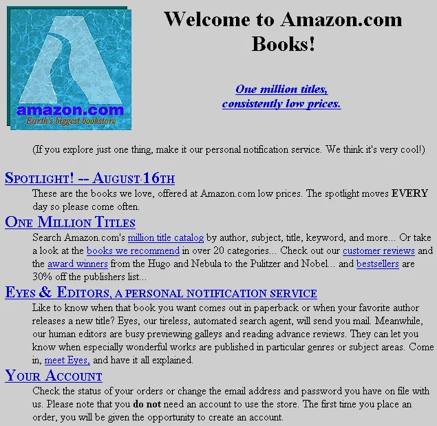

    

# TP Ouro 2.2 - O primeiro site da Amazon.com 

  

A Amazon.com foi fundada em 1994 como um site de venda de livros ("a maior coleção de livros do mundo"). Era sensacional poder pesquisar seu catálogo enorme e poder comprar livros que dificilmente se encontraria numa livraria física, ainda mais aqui no Brasil (e os livros chegavam na sua casa pelos Correios, e sem tributos de importação!).

Neste exercício **você deverá reconstruir a home-page de uma versão de 1995 do site**, mostrada na imagem acima (mas sem precisar acrescentar a imagem com a logomarca de então).